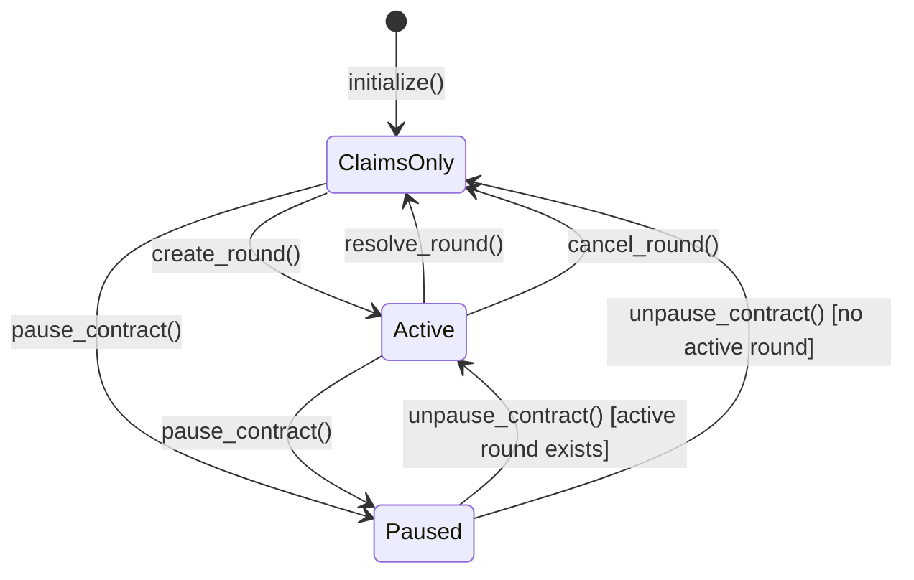
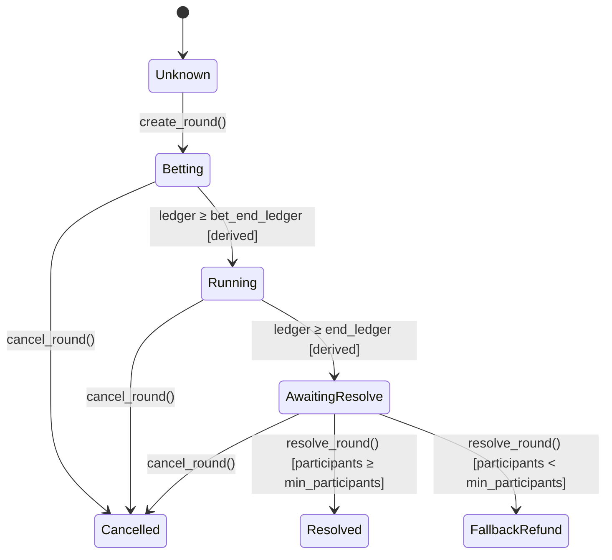

# Status Codes Reference

> **Issue #199** — Explicit user-facing status codes for paused / claims-only / cancelled states.

This document is the canonical reference for the two stable status enums exposed
by the Xelma protocol: `ProtocolStatus` and `RoundStatus`.

Frontends and monitoring dashboards should use these endpoints instead of
combining multiple boolean flags.

---

## `get_protocol_status()` → `ProtocolStatus`

Returns the **global** state of the protocol. Only one of the three variants is
ever active at a given moment.

### Status Codes

| Value | Variant      | Meaning                                                                  |
|-------|--------------|--------------------------------------------------------------------------|
| `0`   | `Active`     | Protocol in `Normal` runtime mode; active round is live.                 |
| `1`   | `Paused`     | Protocol in `FullyPaused` runtime mode; all mutations blocked.            |
| `2`   | `ClaimsOnly` | Protocol in `ClaimsOnly` runtime mode or idle state; claims permitted.   |

> **RuntimeMode Mapping**: `ProtocolStatus::Paused` corresponds strictly to `RuntimeMode::FullyPaused` (`set_runtime_mode(2)`), while `ProtocolStatus::ClaimsOnly` corresponds to `RuntimeMode::ClaimsOnly` (`set_runtime_mode(1)`).
> **Priority rule**: `Paused` is returned first regardless of round state.
> When the contract is paused and an active round exists, `get_protocol_status()`
> still returns `Paused`. The round's own `get_round_status()` continues to
> reflect its temporal phase during the pause.

### Transition Diagram



### Frontend State Machine Notes

- Poll `get_protocol_status()` on page load to gate the entire UI.
- Render a full-screen pause banner when `Paused` is returned.
- Disable all bet/prediction UI and `create_round` controls when `ClaimsOnly`.
- Enable full UI when `Active`.

---

## `get_round_status(round_id)` → `RoundStatus`

Returns the **per-round** lifecycle state identified by its monotonic `round_id`.
Covers all stages from creation through terminal settlement.

### Status Codes

| Value | Variant           | Meaning                                                                         |
|-------|-------------------|---------------------------------------------------------------------------------|
| `0`   | `Unknown`         | Round does not exist or was pruned from the on-chain archive.                   |
| `1`   | `Betting`         | Active; bets and predictions accepted (`ledger < bet_end_ledger`).              |
| `2`   | `Running`         | Betting closed; reveal window open (`bet_end_ledger ≤ ledger < end_ledger`).    |
| `3`   | `AwaitingResolve` | Round ended; awaiting oracle call (`ledger ≥ end_ledger`).                      |
| `4`   | `Resolved`        | Oracle settled normally; pot distributed to winners.                            |
| `5`   | `Cancelled`       | Admin cancelled; all stakes refunded.                                           |
| `6`   | `FallbackRefund`  | Settled with fewer participants than `min_participants`; all stakes refunded.   |

> **Derived states**: `Betting`, `Running`, and `AwaitingResolve` are computed
> from the current ledger sequence compared to the round's ledger bounds — they
> do not involve additional on-chain storage writes.

> **Archive pruning**: Once a terminal round is pruned from the on-chain archive
> (FIFO, controlled by `archive_retention`), `get_round_status()` falls back to
> the lightweight `CancelledRound` marker if it was cancelled, otherwise returns
> `Unknown`. Integrate event indexing for long-term historical queries.

### Transition Diagram



### Lookup Priority in `get_round_status()`

The implementation resolves the status in the following order:

1. **Active round** — If `round_id` matches the current active round, derive
   `Betting` / `Running` / `AwaitingResolve` from ledger position.
2. **Archive** — If an `ArchivedRoundSummary` exists, map its
   `RoundArchiveStatus` to `Resolved`, `Cancelled`, or `FallbackRefund`.
3. **Cancelled marker** — If a `CancelledRound` flag exists (archive may be
   pruned), return `Cancelled`.
4. **Unknown** — The round was never created, or the archive entry was pruned
   and no cancelled marker exists.

### Frontend State Machine Notes

- Use `Betting` to enable the bet / commit prediction widgets.
- Use `Running` to show the "reveal prediction" UI (Precision mode).
- Use `AwaitingResolve` to show an "awaiting oracle" spinner.
- Use `Resolved` / `Cancelled` / `FallbackRefund` to show results and enable claiming.
- Use `Unknown` to show a 404-style "round not found" message.

---

## Interaction Between `ProtocolStatus` and `RoundStatus`

The two codes are **independent** of each other:

| `ProtocolStatus` | `RoundStatus` for active round | Interpretation                                      |
|------------------|---------------------------------|-----------------------------------------------------|
| `Paused`         | `Betting`                       | Contract is paused; round's bet phase will resume when unpaused. |
| `Paused`         | `Running`                       | Contract is paused; reveal window will resume when unpaused.     |
| `Paused`         | `AwaitingResolve`               | Contract is paused; oracle cannot settle until unpaused.         |
| `Active`         | `Betting`                       | Nominal: bets open.                                 |
| `Active`         | `Running`                       | Nominal: reveals open.                              |
| `Active`         | `AwaitingResolve`               | Stale round: oracle settlement overdue.             |
| `ClaimsOnly`     | `Resolved`                      | Normal idle state after settlement.                 |
| `ClaimsOnly`     | `Cancelled`                     | Round was cancelled; users may claim refunds.       |
| `ClaimsOnly`     | `FallbackRefund`                | Round failed minimum participants; users may claim. |

---

## `get_protocol_health()` → `ProtocolHealthStatus`

Returns a composite snapshot of overall protocol health, designed for operator monitoring dashboards, Nagios-compatible probes, and CI smoke gates.

### Health Status Codes (`status_code`)

| Value | Label               | Severity | Meaning                                                                   |
|:-----:|---------------------|:--------:|---------------------------------------------------------------------------|
| `0`   | `HEALTHY`           | OK       | All subsystems nominal: oracle live, not paused, active round healthy.    |
| `1`   | `PAUSED`            | CRIT     | Emergency-paused via `FullyPaused` runtime mode; mutations blocked.       |
| `2`   | `ORACLE_STALE`      | WARN     | Oracle heartbeat timestamp exceeds stale threshold or status is offline. |
| `3`   | `ROUND_STALE`       | WARN     | Active round is past its `end_ledger` and awaiting oracle resolution.     |
| `4`   | `NO_ACTIVE_ROUND`   | OK       | Idle state: no active round, but oracle is live and contract is normal.   |
| `5`   | `MULTIPLE_ISSUES`   | CRIT     | Two or more degradation conditions detected simultaneously.               |
| `6`   | `CLAIMS_ONLY`       | WARN     | Protocol in `ClaimsOnly` runtime mode; round mutations blocked.           |

---

## `RuntimeMode` Entrypoint Policy Matrix

The contract defines three operational runtime modes (`Normal`, `ClaimsOnly`, `FullyPaused`), enforced centrally via `_policy_gate`:

| Entrypoint Category | `Normal` (0) | `ClaimsOnly` (1) | `FullyPaused` (2) | Examples / Methods                                                                                    |
|---------------------|:------------:|:----------------:|:-----------------:|-------------------------------------------------------------------------------------------------------|
| **RoundMutation**   | ✅ Allowed   | ❌ Blocked       | ❌ Blocked        | `place_bet`, `place_precision_prediction`, `predict_price`, `commit_prediction`, `reveal_prediction`, `mint_initial`, `cash_out_early` |
| **Claim**           | ✅ Allowed   | ✅ Allowed       | ❌ Blocked        | `claim_winnings`                                                                                      |
| **Settlement**      | ✅ Allowed   | ✅ Allowed       | ❌ Blocked        | `resolve_round`, `resolve_round_multi`, `cancel_round`                                                |
| **AdminConfig**     | ✅ Allowed   | ✅ Allowed       | ❌ Blocked        | `set_runtime_mode`, `create_round`, `set_windows`, `set_oracle_max_deviation_bps`, etc.              |
| **Read-Only / Hb**  | ✅ Allowed   | ✅ Allowed       | ✅ Allowed        | `update_oracle_heartbeat`, `get_protocol_health`, `get_protocol_status`, `balance`, `get_*`           |

---

## TypeScript Usage

```typescript
import { Client, ProtocolStatus, RoundStatus } from '@xelma/bindings';

const client = new Client({ /* ... */ });

// Single-call protocol gate
const protocolStatus = (await client.get_protocol_status()).result;
if (protocolStatus === ProtocolStatus.Paused) {
  showPauseBanner();
} else if (protocolStatus === ProtocolStatus.ClaimsOnly) {
  showClaimsOnlyBanner();
}

// Round status for a specific round
const roundStatus = (await client.get_round_status({ round_id: BigInt(42) })).result;
switch (roundStatus) {
  case RoundStatus.Betting:
    showBetWidget();
    break;
  case RoundStatus.Running:
    showRevealWidget();
    break;
  case RoundStatus.AwaitingResolve:
    showAwaitingOracleSpinner();
    break;
  case RoundStatus.Resolved:
  case RoundStatus.Cancelled:
  case RoundStatus.FallbackRefund:
    showResultsAndClaimWidget();
    break;
  case RoundStatus.Unknown:
    showRoundNotFound();
    break;
}
```

---

## Related

- [`ROUND_LIFECYCLE.md`](../ROUND_LIFECYCLE.md) — Round lifecycle invariants and resolution logic.
- [`docs/EVENT_SCHEMA.md`](EVENT_SCHEMA.md) — On-chain events emitted at each lifecycle transition.
- [`contracts/src/types.rs`](../contracts/src/types.rs) — Rust enum definitions.
- [`bindings/src/index.ts`](../bindings/src/index.ts) — TypeScript bindings.
